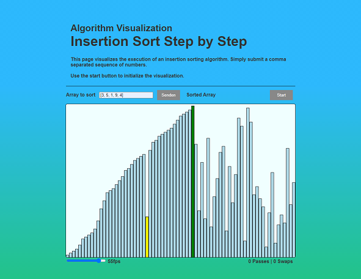

# Visualize Sorting Algorithms

Goal: Implementing a sorting algorithm and creating a front-end visualization of it.



## Environment

### Global Requirements

- node
- npm
- yarn

### Installing Dependencies and Set Up

To install dependencies:

```bash
$ yarn
```

To run tests:

```bash
$ yarn test
```

To start the server:

```bash
$ yarn serve
```

To start the compilation process:

```bash
$ yarn dev
```

You will need to run `yarn serve` and `yarn dev` in separate command line windows/tabs.
